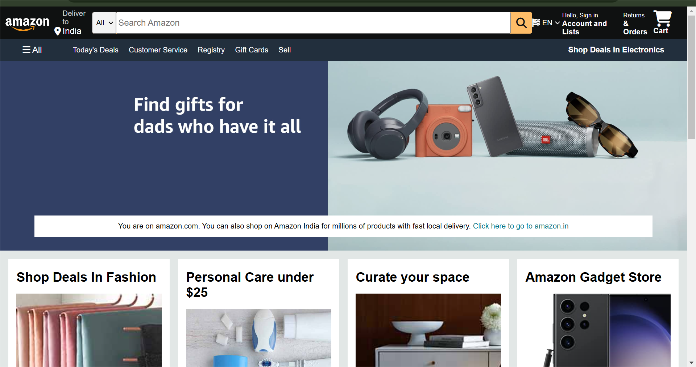

# 🛒 Amazon Clone

A fully responsive Amazon website clone built using **HTML & CSS** while learning from Apna College.

---

## 📌 Features
- ✅ **Homepage** with a navbar, search bar, and shopping cart icon.
- ✅ **Product Listings** with categories.
- ✅ **Footer & Header** similar to Amazon.
- ✅ **Responsive Design** for different screen sizes.
- ✅ **Hover Effects & Animations** using CSS.

---

## 📷 Preview


---

## 🛠 Technologies Used
- **HTML5** → For the structure of the webpage.
- **CSS3** → For styling, flexbox, and grid layouts.

---

## 🚀 How to Run the Project
1. **Clone the Repository:**
   ```sh
   git clone https://github.com/Sagnik-rc/Amazon-Clone.git
   ```
2. **Navigate to the Project Folder:**
   ```sh
   cd amazon-clone
   ```
3. **Open `index.html` in Your Browser.**

---

## 📌 Future Improvements
- 🔄 Adding **JavaScript** for dynamic cart functionality.
- 🛍️ Creating a **checkout page** with dummy payments.
- 🌍 Making it **more responsive** for all devices.

---

## 🎓 Credits
This project was built while learning from [Apna College](https://github.com/apna-college).

---

## 📩 Connect with Me
📌 **GitHub**: [Sagnik-rc](https://github.com/Sagnik-rc)  
📌 **LinkedIn**: [Sagnik Roy Chowdhury](https://www.linkedin.com/in/sagnik-roy-chowdhury-138286297/)  

---

🚀 *Happy Coding!*
